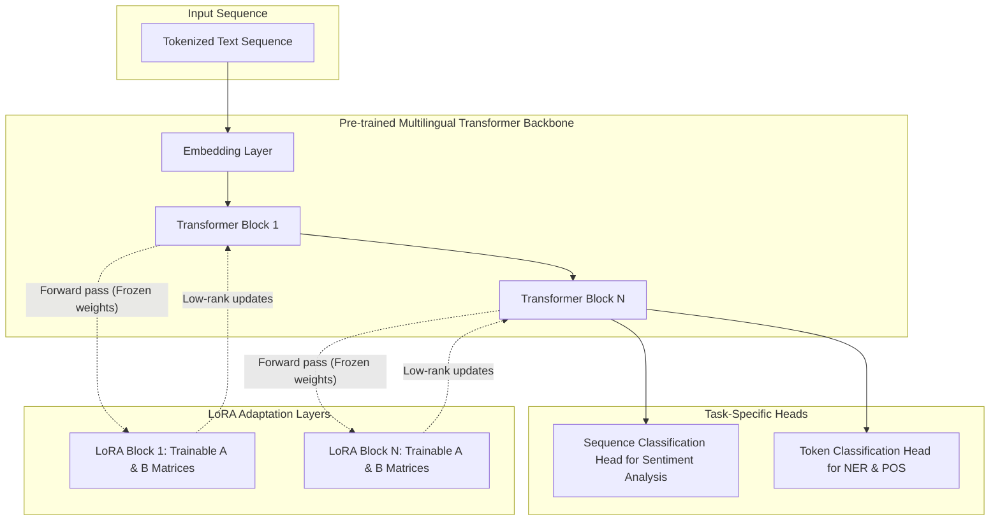

# Model Architecture (PEFT / LoRA)

```mermaid
flowchart TB
    subgraph Input Sequence
        A[Tokenized Text Sequence]
    end

    subgraph Pre-trained Multilingual Transformer Backbone
        direction TB
        B[Embedding Layer]
        C[Transformer Block 1]
        D[Transformer Block N]
        
        B --> C
        C --> D
    end
    
    subgraph LoRA Adaptation Layers
        direction TB
        L1[LoRA Block 1: Trainable A & B Matrices]
        LN[LoRA Block N: Trainable A & B Matrices]
    end

    C -.-> |"Forward pass (Frozen weights)"| L1
    L1 -.-> |"Low-rank updates"| C
    
    D -.-> |"Forward pass (Frozen weights)"| LN
    LN -.-> |"Low-rank updates"| D

    subgraph Task-Specific Heads
        E1[Sequence Classification Head for Sentiment Analysis]
        E2[Token Classification Head for NER & POS]
    end

    A --> B
    D --> E1
    D --> E2

```
