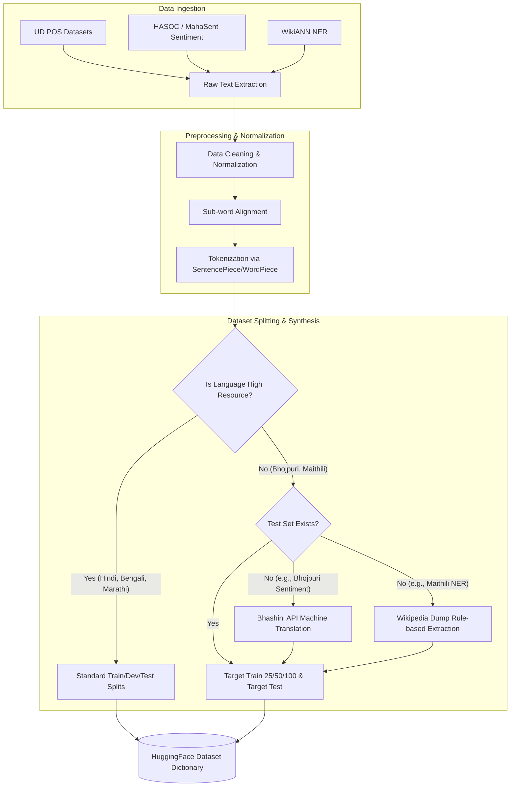

# Data Pipeline Architecture

```mermaid
flowchart TD
    subgraph Data Ingestion
        A1[UD POS Datasets] --> B
        A2[HASOC / MahaSent Sentiment] --> B
        A3[WikiANN NER] --> B
    end

    subgraph Preprocessing & Normalization
        B[Raw Text Extraction] --> C[Data Cleaning & Normalization]
        C --> D[Sub-word Alignment]
        D --> E[Tokenization via SentencePiece/WordPiece]
    end

    subgraph Dataset Splitting & Synthesis
        E --> F{Is Language High Resource?}
        F -- Yes (Hindi, Bengali, Marathi) --> G[Standard Train/Dev/Test Splits]
        F -- No (Bhojpuri, Maithili) --> H{Test Set Exists?}
        H -- Yes --> I[Target Train 25/50/100 & Target Test]
        H -- No (e.g., Bhojpuri Sentiment) --> J[Bhashini API Machine Translation]
        H -- No (e.g., Maithili NER) --> K[Wikipedia Dump Rule-based Extraction]
        J --> I
        K --> I
    end

    G --> L[(HuggingFace Dataset Dictionary)]
    I --> L
```
