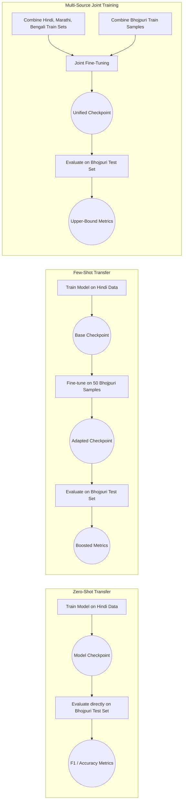

# Cross-Lingual Transfer Strategies

```mermaid
flowchart LR
    subgraph Zero-Shot Transfer
        A1[Train Model on Hindi Data] --> B1((Model Checkpoint))
        B1 --> C1[Evaluate directly on Bhojpuri Test Set]
        C1 --> D1((F1 / Accuracy Metrics))
    end

    subgraph Few-Shot Transfer
        A2[Train Model on Hindi Data] --> B2((Base Checkpoint))
        B2 --> C2[Fine-tune on 50 Bhojpuri Samples]
        C2 --> D2((Adapted Checkpoint))
        D2 --> E2[Evaluate on Bhojpuri Test Set]
        E2 --> F2((Boosted Metrics))
    end

    subgraph Multi-Source Joint Training
        A3[Combine Hindi, Marathi, Bengali Train Sets] --> B3
        C3[Combine Bhojpuri Train Samples] --> B3
        B3[Joint Fine-Tuning] --> D3((Unified Checkpoint))
        D3 --> E3[Evaluate on Bhojpuri Test Set]
        E3 --> F3((Upper-Bound Metrics))
    end
```
